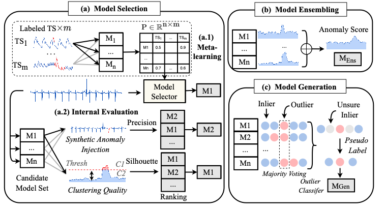
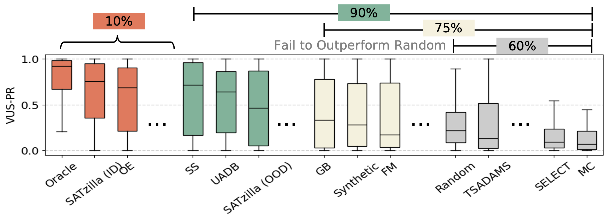

<h1 align="center">📈 TSB-AutoAD</h1>
<h2 align="center">Towards Automated Solutions for Time-Series Anomaly Detection</h2>

## Table of Contents

- [📄 Overview](#overview)
- [✍️ Get Started](#start)
- [📖 More Details about TSB-AutoAD](#tsb)

<h2 id="overview"> 📄 Overview </h2>

<p align="center">

</p>

Despite decades of research on time-series anomaly detection, the effectiveness of existing anomaly detectors remains constrained to specific domains—a model that performs well on one dataset may fail on another. Consequently, developing automated solutions for anomaly detection remains a pressing challenge. However, the AutoML community has predominantly focused on supervised learning solutions, which are impractical for anomaly detection due to the lack of labeled data and the absence of a well-defined objective function for model evaluation.  While recent studies have evaluated standalone anomaly detectors, no study has ever evaluated automated solutions for selecting or generating scores in an automated manner. In this study, we (i) provide a systematic review and taxonomy of automated solutions for time-series anomaly detection, categorizing them into selection, ensembling, and generation methods; (ii) introduce TSB-AutoAD, a comprehensive benchmark encompassing 20 standalone methods and 70 variants; and (iii) conduct the most extensive evaluation in this area to date. Our benchmark includes state-of-the-art methods across all three categories, evaluated on TSB-AD, a recently curated heterogeneous testbed from nine domains. Our findings reveal a significant gap, where over half of the proposed solutions to date do not statistically outperform a simple random choice. Foundation models that claim to offer generalized, one-size-fits-all solutions, have yet to deliver on this promise. Additionally, while naive ensembling demonstrates robust performance, it comes at the cost of substantial computational overhead. Methods leveraging historical datasets enable fast inference but suffer from severe performance degradation under out-of-distribution scenarios. To promote further research, we open-source TSB-AutoAD and highlight the need for advancements in developing robust and efficient automated solutions.


<h2 id="start"> ✍️ Get Started </h2>

**Step 1:** Clone this repository using `git` and change into its root directory.

**Step 2:** Install the dependencies from requirements.txt:
```bash
pip install -r requirements.txt
```

**Step 3:** Install the package:
```bash
pip install -e .
```

<h3 id="usage">🧑‍💻 Running benchmark experiments</h3>

See Example in `benchmark_exp/Step_2_run_AutoAD_U/M.py`

```bash
python Step_2_run_AutoAD_U/M.py --AutoAD_Name OE
```


<h2 id="tsb"> 📖 More Details about TSB-AutoAD </h2>

### Configuration

* Hyper-parameter of Candidate Model Set: See `testbed/HP_list.py`
* Dataset Splitting: See `testbed/file_list`

### Evaluation Overview

<p align="center">

</p>